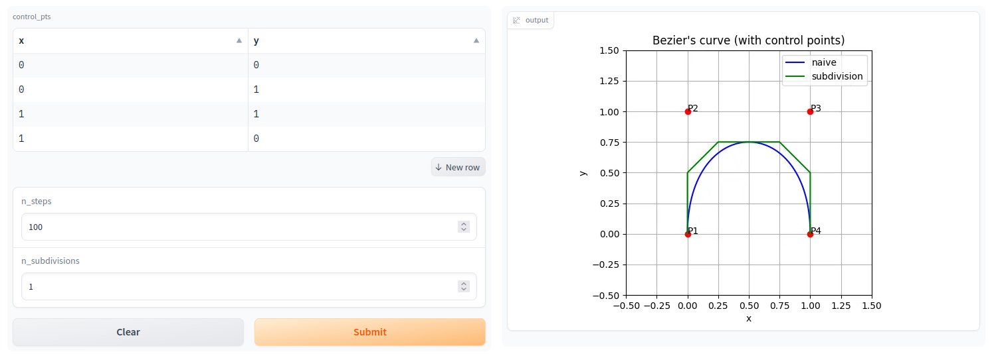

# Bezier's curve

A simple gradio app for drawing a Bezier's curve.



## Installation
```sh
pip install -r requirements.txt
```

## Usage
After installing requirements just launch the `serve.py` file and go to the assigned address (http://127.0.0.1:7860 by default).
